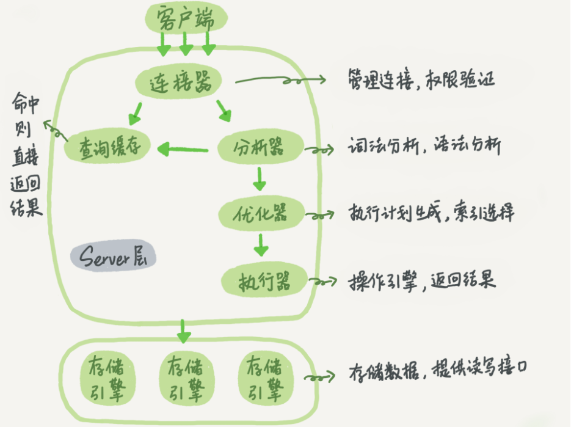
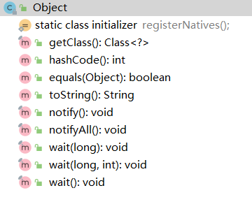
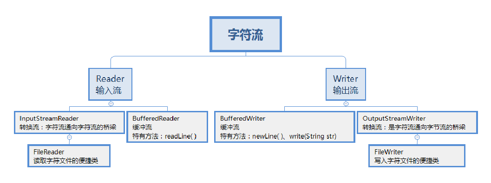

## 8 种基本数据类型

Java 中有 8 种基本数据类型，分别为：

+ 6 种数字类型： 
  - 4 种整数型：byte、short、int、long
  - 2 种浮点型：float、double
+ 1 种字符类型：char
+ 1 种布尔型：boolean



## == 与 equals(重要)

**==** 

它的作⽤是判断两个对象的地址是不是相等。即，判断两个对象是不是同⼀个对象(基本数据类型==⽐较的是值，引⽤数据类型==⽐较的是内存地址)。

equals() 

它的作⽤也是判断两个对象是否相等。但它⼀般有两种使⽤情况：

1. 情况 1：类没有覆盖 equals() ⽅法。则通过 equals() ⽐较该类的两个对象时，等价于通过“==”⽐较这两个对象。

2. 情况 2：类覆盖了 equals() ⽅法。⼀般，我们都覆盖 equals() ⽅法来⽐较两个对象的内容是否相等；若它们的内容相等，则返回 true (即，认为这两个对象相等)。

## 重载和重写的区别

### 重载

发生在同一个类中（或者父类和子类之间），方法名必须相同，参数类型不同、个数不同、顺序不同，方法返回值和访问修饰符可以不同。

### 重写

重写发生在运行期，是子类对父类的允许访问的方法的实现过程进行重新编写。

1. 方法名、参数列表必须相同，子类方法**返回值**类型应比父类方法返回值类型**更小**或相等，抛出的**异常**范围小于等于父类，**访问修饰符**范围**大于**等于父类。
2. 如果父类方法访问修饰符为 `private/final/static` 则子类就不能重写该方法，但是被 `static` 修饰的方法能够被再次声明。
3. 构造方法无法被重写


## 面向对象

### Object类有哪些方法？



Java 中所有的类都有一个共同的祖先 Object 类，子类都会继承所有 Object 类中的 public 方法。

先看下 Object 的类结构（**快捷键：alt+7**）：

1. getClass 方法

```java
public final native Class<?> getClass();
```

final 方法、获取对象的运行时 class 对象，class 对象就是描述对象所属类的对象。这个方法通常是和 Java 反射机制搭配使用的。

2. hashCode 方法

```java
public native int hashCode();
```

该方法主要用于获取对象的散列值。Object 中该方法默认返回的是对象的堆内存地址。

3. equals 方法

```java
public boolean equals(Object obj) {        return (this == obj);}
```

该方法用于比较两个对象，如果这两个对象引用指向的是同一个对象，那么返回 true，否则返回 false。一般 equals 和 == 是不一样的，但是在 Object 中两者是一样的。子类一般都要重写这个方法。

4. clone 方法

```java
protected native Object clone() throws CloneNotSupportedException;
```

该方法是保护方法，实现对象的浅复制，只有实现了 Cloneable 接口才可以调用该方法，否则抛出 CloneNotSupportedException 异常。

默认的 clone 方法是浅拷贝。所谓浅拷贝，指的是对象内属性引用的对象只会拷贝引用地址，而不会将引用的对象重新分配内存。深拷贝则是会连引用的对象也重新创建。

5. toString 方法

```java
public String toString() {
        return getClass().getName() + "@" + Integer.toHexString(hashCode());
}
```

返回一个 String 对象，一般子类都有覆盖。默认返回格式如下：对象的 class 名称 + @ + hashCode 的十六进制字符串。

6. notify 方法

```java
public final native void notify();
```

final 方法，主要用于唤醒在该对象上等待的某个线程。

7. notifyAll 方法

```java
public final native void notifyAll();
```

final 方法，主要用于唤醒在该对象上等待的所有线程。

8. wait(long timeout) 方法

```java
public final native void wait(long timeout) throws InterruptedException;
```

wait 方法就是使当前线程等待该对象的锁，当前线程必须是该对象的拥有者，也就是具有该对象的锁。wait() 方法一直等待，直到获得锁或者被中断。wait(long timeout) 设定一个超时间隔，如果在规定时间内没有获得锁就返回。

9. wait(long timeout, int nanos) 方法

```java
public final void wait(long timeout, int nanos) throws InterruptedException {
  if (timeout < 0) {
    throw new IllegalArgumentException("timeout value is negative");
  }

  if (nanos < 0 || nanos > 999999) {
    throw new IllegalArgumentException(
              "nanosecond timeout value out of range");
  }

  if (nanos >= 500000 || (nanos != 0 && timeout == 0)) {
    timeout++;
  }

  wait(timeout);
}
```

参数说明 

timeout：最大等待时间（毫秒） 

nanos：附加时间在毫秒范围（0-999999） 

该方法导致当前线程等待，直到其他线程调用此对象的 notify() 方法或notifyAll()方法，或在指定已经过去的时间。此方法类似于 wait 方法的一个参数，但它允许更好地控制的时间等待一个通知放弃之前的量。实时量，以毫微秒计算，计算公式如下：

```java
1000000 * timeout + nanos
```

在所有其他方面，这种方法与 wait(long timeout) 做同样的事情。特别是 wait(0, 0) 表示和 wait(0) 相同。

10. wait 方法

```java
public final void wait() throws InterruptedException {  wait(0);}
```

可以看到 wait() 方法实际上调用的是 wait(long timeout) 方法，只不过 timeout 为 0，即不等待。 

11. finalize 方法

```java
protected void finalize() throws Throwable { }
```

该方法是保护方法，主要用于在 GC 的时候再次被调用，如果我们实现了这个方法，对象可能在这个方法中再次复活，从而避免被 GC 回收。  

### 面对对象的特性

继承：继承是从已有类得到继承信息创建新类的过程。

封装：通常认为封装是把数据和操作数据的方法绑定起来，对数据的访问只能通过已定义的接口。

多态性：多态性是指允许不同子类型的对象对同一消息作出不同的响应。简单的说就是用同样的对象引用调用同样的方法但是做了不同的事情。多态性分为**编译时**的多态性和**运行时**的多态性。

抽象：抽象是将一类对象的共同特征总结出来构造类的过程，包括数据抽象和行为抽象两方面。抽象只关注对象有哪些属性和行为，并不关注这些行为的细节是什么。

### 多态

从静态和动态的角度进行划分，多态可以分为 编译时多态 和 运行时多态。

编译时多态是静态的，主要是指方法的重载，它是根据参数列表的不同来区分不同的方法，编译之后会变成两个不同的方法。

而运行时多态是动态的，是通过动态绑定来实现的。

### **多态的特点**

- 只有在运行的时候才知道引用指向的是哪个类的实例对象，以及引用调用的方法指向的是哪个类中实现的方法。

+ 对象类型和引用类型之间具有继承（类）/实现（接口）的关系；
+ 引用类型变量发出的方法调用的到底是哪个类中的方法，必须在程序运行期间才能确定；
+ 多态不能调用“只在子类存在但在父类不存在”的方法；
+ 如果子类重写了父类的方法，真正执行的是子类覆盖的方法，如果子类没有覆盖父类的方法，执行的是父类的方法。

多态通常有两种实现方法：

    1. 子类继承父类（extends）
    2. 类实现接口（implements）

多态核心之处就在于对父类方法的重写或对接口方法的实现，以此在运行时实现不同的执行效果。

### 接口和抽象类有什么共同点和区别？

**共同点** ：

+ 都不能被实例化。
+ 都可以包含抽象方法。
+ 都可以有默认实现的方法（Java 8 可以用 `default` 关键在接口中定义默认方法）。

**区别** ：

+ 接口主要用于对类的行为进行约束，你实现了某个接口就具有了对应的行为。抽象类主要用于代码复用，强调的是所属关系。
+ 一个类只能继承一个类，但是可以实现多个接口。
+ 接口中的成员变量只能是 `public static final` 类型的，不能被修改且必须有初始值，而抽象类的成员变量默认 default，可在子类中被重新定义，也可被重新赋值。


## 异常处理


Error类一般是指与虚拟机相关的问题，如系统崩溃，虚拟机错误，内存空间不足，方法调用栈溢出等。对于这类错误的导致的应用程序中断，仅靠程序本身无法恢复和预防。

Exception类表示程序可以处理的异常。又分为运行时异常（ Runtime Exception ）和受检查的异常 (Checked Exception )。

**运行时异常（ unchecked 异常）**：`ArithmaticException`，`IllegalArgumentException` ，编译能通过，但是一运行就终止了，程序不会处理运行时异常出现这类异常，程序会终止。

**Checked异常，要么用 try ... catch 捕获，要么用 throws 字句声明抛出，交给它的父类处理，否则编译不会通过。**

请写出你最常见的 5 个 RuntimeException  

- java.lang.NullPointerException **空指针异常**；出现原因：调用了未经初始化的对象或者是不存在的对象 。
- java.lang.ClassNotFoundException 指定的**类找不到**；出现原因：类的名称和路径加载错误；通常都是程序 
  试图通过字符串来加载某个类时可能引发异常 。  
- java.lang.NumberFormatException 字符串转换为数字异常；出现原因：字符型数据中包含非数字型字符 。
- java.lang.IndexOutOfBoundsException 数组角标越界异常 ，常见于操作数组对象时发生。 
- java.lang.IllegalArgumentException 方法传递参数错误 。  
- java.lang.ClassCastException 数据类型转换异常。
- java.lang.NoClassDefFoundException 未找到类定义错误。 
- SQLException SQL 异常，常见于 操作数据库时的 **SQL 语句错误**。  
- java.lang.InstantiationException 实例化异常。
- java.lang.NoSu chMethodException 方 法不存在异常。

### try-catch-finally处理流程

```java
try{
    int a=1/0;
    System.out.println(1);
    return ;
}
catch (Exception e){
    System.out.println(2);
    return ;
}
finally {
    System.out.println(3);
}

执行顺序：2、7、11、8
```


```java
try{
    int a=1/0;    #遇到异常，下面的均不执行
    System.out.println(1);
    return ;
}
catch (Exception e){
    System.out.println(2); #这一行执行，下面一行不执行
    return ;
}
finally {
    System.out.println(3); #这一行执行，下面一行也执行
    return ;
}
执行顺序：2、7、11、12
```

如果在 catch 中遇到了 return 或者异常等能使该函数终止的话，那么有 finally 就必须先执行完 finally 代码块里面的代码然后再返回值。


异常处理总结

try 块： ⽤于捕获异常。其后可接零个或多个 catch 块，如果没有 catch 块，则必须跟⼀个 finally 块。

catch 块： ⽤于处理 try 捕获到的异常。

finally 块： ⽆论是否捕获或处理异常， finally 块⾥的语句都会被执⾏。当在 try 块或catch 块中遇到 return 语句时， finally 语句块将在⽅法返回之前被执⾏。

在以下 3 种特殊情况下， finally 块不会被执⾏：

1. 在 try 或 finally 块中⽤了 System.exit(int) 退出程序。但是，如果 System.exit(int) 在异常语句之后， finally 还是会被执⾏。

2. 程序所在的线程死亡。

3. 关闭 CPU。


### throw 和 throws 的区别

throw：

1）throw 语句用在方法体内，表示抛出异常，由方法体内的语句处理。

2）throw 是具体向外抛出异常的动作，所以它抛出的是一个异常实例，执行 throw 一定是抛出了某种异常。

throws：

1）throws 语句是用在方法声明后面，表示如果抛出异常，由该方法的调用者来进行异常的处理。

2）throws 主要是声明这个方法会抛出某种类型的异常，让它的使用者要知道需要捕获的异常的类型。

3）throws 表示出现异常的一种可能性，并不一定会发生这种异常。

### final、finally、finalize 的区别？

1）final：用于声明属性，方法和类，分别表示属性不可变，方法不可覆盖，被其修饰的类不可继承。

2）finally：异常处理语句结构的一部分，表示总是执行。

3）finalize：Object 类的一个方法，在垃圾回收器执行的时候会调用被回收对象的此方法，可以覆盖此方法

提供垃圾收集时的其他资源回收，例如关闭文件等。该方法更像是一个对象生命周期的临终方法，当该方法

被系统调用则代表该对象即将“死亡”，但是需要注意的是，我们主动行为上去调用该方法并不会导致该对

象“死亡”，这是一个被动的方法（其实就是回调方法），不需要我们调用。

## 注解的解析方法有哪几种？

注解只有被解析之后才会生效，常见的解析方法有两种：

+ **编译期直接扫描**：编译器在编译 Java 代码的时候扫描对应的注解并处理，比如某个方法使用@Override 注解，编译器在编译的时候就会检测当前的方法是否重写了父类对应的方法。
+ **运行期通过反射处理**：像框架中自带的注解(比如 Spring 框架的 @Value、@Component)都是通过反射来进行处理的。


## IO流

### 种类

+ 按照流的**流向**分，可以分为输入流和输出流；
+ 按照**操作单元**划分，可以划分为字节流和字符流；
+ 按照流的角色划分为节点流和处理流。

Java IO 流的 40 多个类都是从如下 4 个抽象类基类中派生出来的。

+ InputStream/Reader: 所有的输入流的基类，前者是字节输入流，后者是字符输入流。
+ OutputStream/Writer: 所有输出流的基类，前者是字节输出流，后者是字符输出流。


按照流的方向：**输入流（inputStream）**和**输出流（outputStream）**。

按照实现功能分：**节点流**（可以从或向一个特定的地方（节点）读写数据。如 FileReader）和**处理流**（是对一个

已存在的流的连接和封装，通过所封装的流的功能调用实现数据读写。如 BufferedReader。处理流的构造方法总是要带一个其他的流对象做参数。一个流对象经过其他流的多次包装，称为流的链接。）

按照处理数据的单位：**字节流和字符流**。字节流继承于 InputStream 和 OutputStream，字符流继承于

InputStreamReader 和 OutputStreamWriter。




### 字节流如何转为字符流

字节输入流转字符输入流通过 InputStreamReader 实现，该类的构造函数可以传入 InputStream 对象。

字节输出流转字符输出流通过 OutputStreamWriter 实现，该类的构造函数可以传入 OutputStream 对象。

### 既然有了字节流,为什么还要有字符流?

问题本质想问：**不管是文件读写还是网络发送接收，信息的最小存储单元都是字节，那为什么 I/O 流操作要分为字节流操作和字符流操作呢？**

回答：**Java 虚拟机将字节转换成字符流，非常耗时**。对未知的编码类型很**容易出现乱码问题**。所以， I/O 流**提供**了一个**直接操作字符的接口**，方便我们平时对字符进行流操作。如果音频文件、图片等媒体文件用字节流比较好，如果涉及到字符的话使用字符流比较好。

### 什么是序列化?什么是反序列化?

如果我们需要持久化 Java 对象比如将 Java 对象保存在文件中，或者在网络传输 Java 对象，这些场景都需要用到序列化。

+ **序列化**： 将数据结构或对象转换成二进制字节流的过程
+ **反序列化**：将在序列化过程中所生成的二进制字节流转换成数据结构或者对象的过程

**序列化的主要目的是通过网络传输对象或者说是将对象存储到文件系统、数据库、内存中。**

### Java 序列化中如果有些字段不想进行序列化，怎么办？

对于不想进行序列化的变量，使用 **transient**关键字修饰。

`transient` 关键字的作用是：阻止实例中那些用此关键字修饰的的变量序列化；当对象被反序列化时，被 `transient` 修饰的变量值不会被持久化和恢复。

关于 `transient` 还有几点注意：

+ `transient` **只能修饰变量，不能修饰类和方法**。
+ `transient` 修饰的变量，在**反序列化后变量值将会被置成类型的默认值**。例如，如果是修饰 `int` 类型，那么**反序列后结果就是 **`0`。
+ **static** 变量因为不属于任何对象(Object)，所以无论有没有 `transient` 关键字修饰，**均不会被序列化**。