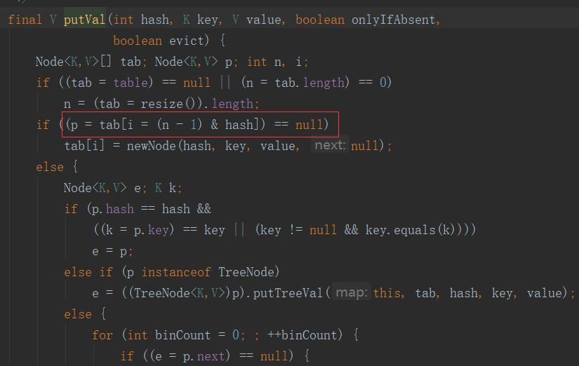
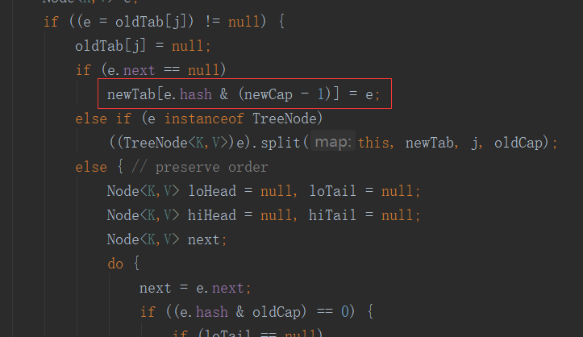
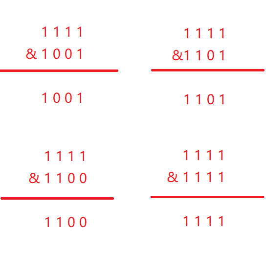
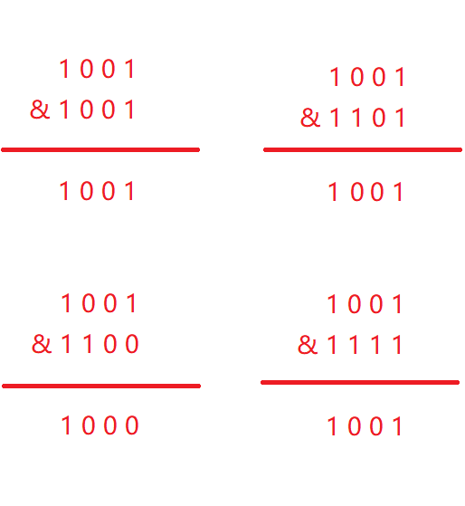

## 常用集合

## 说说 List, Set, Map 三者的区别？

+ `List`(对付顺序的好帮手): 存储的元素是有序的、可重复的。 
  - `Arraylist`： `Object[]` 数组 
    * 扩容，**默认是10**。int newCapacity = oldCapacity + (oldCapacity >> 1),所以  ArrayList 每次**扩容之后**容量都会变为原来的 **1.5 倍**左右（oldCapacity 为偶数就是 1.5 倍，否则是 1.5 倍左右）
  - `Vector`：`Object[]` 数组，线程安全的
  - `LinkedList`： 双向链表
    * **双向链表：** 包含两个指针，一个 prev 指向前一个节点，一个 next 指向后一个节点
+ `Set`(注重独一无二的性质): 存储的元素是无序的、不可重复的。 
  - `HashSet`(无序，唯一): 基于 `HashMap` 实现的，底层采用 `HashMap` 来保存元素
  - `LinkedHashSet`: `LinkedHashSet` 是 `HashSet` 的子类，并且其内部是通过 `LinkedHashMap` 来实现的。
  - `TreeSet`(有序，唯一): 红黑树(自平衡的排序二叉树)
+ `Map`: 使用键值对（key-value）存储，key 是无序的、不可重复的，value 是无序的、可重复的，每个键最多映射到一个值。 
  - `HashMap`： JDK1.8 之前 `HashMap` 由数组+链表组成的，数组是 `HashMap` 的主体，链表则是主要为了解决哈希冲突而存在的。JDK1.8  以后，当链表长度大于阈值（默认为 8）（将链表转换成红黑树前会判断，如果当前数组的长度小于  64，那么会选择先进行数组扩容，而不是转换为红黑树）时，将链表转化为红黑树，以减少搜索时间。HashMap 允许 null 键和 null 值，在计算键的哈希值时，null 键哈希值为 0。 
    * 在 HashMap 构造方法中，可供我们调整的参数有两个：初始容量 initialCapacity和负载因子  loadFactor。通过设定这两个参数，可以进一步影响阈值大小。但初始阈值 threshold 仅由 initialCapacity  经过移位操作计算得出。threshold 当前 HashMap 所能容纳键值对数量的最大值，超过这个值，则需扩容。默认情况下（构造方法有四个），**HashMap 初始容量是16**，**负载因子为 0.75**。这里并没有默认阈值，原因是阈值可由容量乘上负载因子计算而来，即`threshold = capacity * loadFactor`（阈值=容量*负载因子）。
    * **负载因子的作用**，阈值=容量*负载因子。超过阈值会进行扩容。在负载因子为1的时候，产生hash冲突的概率是最大的。Map 扩容时的 rehash 机制，rehash算法，扩容后重新为里面的键值对寻址的算法。
    * HashMap 的容量都是 2 的幂次方，是因为可以通过**按位与操作来计算余数**，比求模要快。
  - `LinkedHashMap`： `LinkedHashMap` 继承自 `HashMap`，在 HashMap 基础上，通过维护一条双向链表，保持键值对的插入顺序。实现了访问顺序相关逻辑。应用场景：缓存
  - `Hashtable`： 数组+链表组成的，数组是 `Hashtable` 的主体，链表则是主要为了解决哈希冲突而存在的。线程安全。
  - `TreeMap`： 红黑树（自平衡的排序二叉树） 
    * 可保证在`log(n)`时间复杂度内完成 containsKey、get、put 和 remove 操作，效率很高。

## 红黑树

红黑树是一种自平衡的二叉查找树。  
普通的二叉查找树在极端情况下可退化成链表，此时的增删查效率都会比较低下。为了避免这种情况，就出现了一些自平衡的查找树，比如 AVL，红黑树等。

**性质**

1. 节点是红色或黑色。
2. 根是黑色。
3. 所有叶子都是黑色（叶子是NIL节点）。
4. 从**每个叶子到根**的所有路径上**不能有两个连续的红色节点**。
5. 从**任一节点到其每个叶子**的所有简单路径都包含**相同数目的黑色节点**。

当某条路径最短时，这条路径必然都是由黑色节点构成。  
当某条路径长度最长时，这条路径必然是由红色和黑色节点相间构成。路径上红色节点数量 = 黑色节点数量。该路径长度为两倍黑色节点数量，也就是最短路径长度的2倍。

## Arraylist 与 LinkedList 区别?

1. **是否保证线程安全：** `ArrayList` 和 `LinkedList` 都是线程不安全的；
2. **底层数据结构：** `Arraylist` 底层使用的是 `Object` 数组**；`LinkedList` 底层使用的是 **双向链表数据结构（JDK1.6 之前为循环链表，JDK1.7 取消了循环。）
3. 插入和删除是否受元素位置的影响： 
   - `ArrayList` 采用数组存储，所以插入和删除元素的时间复杂度受元素位置的影响。 比如：执行`add(E e)`方法的时候， `ArrayList` 会默认在将指定的元素追加到此列表的末尾，这种情况时间复杂度就是 O(1)。但是如果要在指定位置 i 插入和删除元素的话（`add(int index, E element)`）时间复杂度就为 O(n-i)。因为在进行上述操作的时候集合中第 i 和第 i 个元素之后的(n-i)个元素都要执行向后位/向前移一位的操作。
   - `LinkedList` 采用链表存储，所以，如果是在头尾插入或者删除元素不受元素位置的影响（`add(E e)`、`addFirst(E e)`、`addLast(E e)`、`removeFirst()` 、 `removeLast()`），近似 O(1)，如果是要在指定位置 `i` 插入和删除元素的话（`add(int index, E element)`，`remove(Object o)`） 时间复杂度近似为 O(n) ，因为需要先移动到指定位置再插入。
4. **是否支持快速随机访问：** `LinkedList` 不支持高效的随机元素访问，而 `ArrayList` 支持。快速随机访问就是通过元素的序号快速获取元素对象(对应于`get(int index)`方法)。
5. **内存空间占用：** ArrayList 的空间浪费主要体现在在 list **列表的结尾会预留一定的容量空间**，而 LinkedList 的空间花费则体现在它的**每一个元素都需要消耗**比 ArrayList **更多的空间**（因为要存放直接后继和直接前驱以及数据）。

## HashMap 和 Hashtable 的区别

1. **线程是否安全：** `HashMap` 是非线程安全的，`Hashtable` 是线程安全的,因为 `Hashtable` 内部的方法基本都经过`synchronized` 修饰。
2. **效率：** 因为线程安全的问题，`HashMap` 要比 `Hashtable` 效率高一点。
3. **对 Null key 和 Null value 的支持：** `HashMap` 可以存储 null 的 key 和 value，但 null 作为键只能有一个，null 作为值可以有多个；Hashtable 不允许有 null 键和 null 值，否则会抛出 `NullPointerException`。
4. **初始容量大小和每次扩充容量大小的不同 ：** ① 创建时如果不指定容量初始值，`**Hashtable**`** 默认的初始大小为 11**，之后每次扩充，容量变为原来的 **2n+1**。`HashMap` **默认的 数组的长度初始化大小为 16。之后每次扩充，容量变为原来的 2 倍。**② 创建时如果给定了容量初始值，那么 Hashtable 会直接使用你给定的大小，而 `HashMap` 会将其扩充为 2 的幂次方大小（`HashMap` 中的`tableSizeFor()`方法保证，`HashMap` 总是使用 2 的幂作为哈希表的大小,后面会介绍到为什么是 2 的幂次方。
5. **底层数据结构：** JDK1.8 以后的 `HashMap` 在解决哈希冲突时有了较大的变化，当链表长度大于阈值（默认为 8）（将链表转换成红黑树前会判断，如果当前数组的长度小于 64，那么会选择先进行数组扩容，而不是转换为红黑树）时，将链表转化为红黑树，以减少搜索时间。Hashtable 没有这样的机制。

## HashMap和ConcurrentHashMap区别

1. HashMap  
   1. HashMap 实现：**数组+链表**，数组中的每一项是一个链表。通过计算存入对象的 HashCode，来计算对象在数组中要存入的位置，用链表来解决散列冲突，链表中的节点存储的是键值对。 
   2. 负载因子的作用，阈值=容量*负载因子。超过阈值会进行扩容。在负载因子为1的时候，产生hash冲突的概率是最大的。Map 扩容时的 rehash 机制，rehash算法，扩容后重新为里面的键值对寻址的算法。HashMap 的容量都是 2 的幂次方，是因为可以通过**按位与操作来计算余数**，比求模要快。 HashMap 是**非线程安全**的，在多线程 put 的情况下，因为 HashMap 为了**避免尾部遍历**，在链表插入元素时使用**头插法**，多线程的场景下有可能会产生死循环。
2. ConcurrentHashMap
   1. 1.7 中使用 Segment 进行分段加锁，降低并发锁定发生频率；1.8 中使用 CAS 自旋锁和乐观锁来提高性能，但是在并发度较高时性能会比较一般。另外 1.8 中的 ConcurrentHashMap 引入了红黑树来解决 Hash 冲突时链表顺序查找的问题。红黑树的启用条件与链表的长度和 Map 的总容量有关，默认是链表大于 8 且容量大于 64 时转为红黑树。

## 为什么HashMap的长度是2的整数次幂？

1.  为了**加快哈希计算**以及**减少哈希冲突。**

为什么扩容2的n次幂？

**HashMap中的putVal方法(存值的)和resize方法(扩容的)，HashMap扩容是2的n次幂和这两个方法有联系。**

通过putVal方法可以看出来HashMap在存值时会先把key的hash值和扩容后的长度进行一次按位与运算，其中hash是在hash方法中把key进行计算后的出来的结果，n是扩容的长度（也就是数组的长度，默认为16），然后判断是否hash碰撞在进行不同的存储。如下图源码所示。

通过resize方法可以看出来扩容时会新建一个tab，然后遍历旧的tab，将旧的元素进行e.hash & (newCap - 1)的计算添加进新的tab中，也就是**(n - 1) & hash的计算方法，其中n是集合的容量，hash是添加的元素经过hash函数计算出来的hash值。**如下图源码所示。

**这两个方法都使用了按位与运算，按位与运算就是把值先变成二进制然后进行运算，如果有0则为0，都为1时则输出为1，HashMap默认容量为16，那么在存放到数组时就是n-1也就是15，而15二进制则是1111扩容后为32-1及11111111，如果都为1的情况下是可以极大的减少hash碰撞，增加效率的。**

通过下面例子来看一下当容量为11111111时按位与运算的结果，通过下面的结果可以看出来结果很分散，大大减少了hash碰撞的发生。 

再看一下当容量不为11111111而是为其他值的时候，通过下面的结果可以看出，1、2、4跟不同的值进行hash运算但是结果却是相同的，也就是发生了hash碰撞。 

## Collection 子接口之 Queue

### Queue 与 Deque 的区别

`Queue` 是**单端队列**，只能从一端插入元素，另一端删除元素，实现上一般遵循 **先进先出（FIFO）** 规则。

`Queue` 扩展了 `Collection` 的接口，根据 **因为容量问题而导致操作失败后处理方式的不同** 可以分为两类方法: 一种在操作失败后会抛出异常，另一种则会返回特殊值。

| `Queue` 接口 | 抛出异常  | 返回特殊值 |
| ------------ | --------- | ---------- |
| 插入队尾     | add(E e)  | offer(E e) |
| 删除队首     | remove()  | poll()     |
| 查询队首元素 | element() | peek()     |

`Deque` 是**双端队列**，在队列的两端均可以插入或删除元素。

`Deque` 扩展了 `Queue` 的接口, 增加了在队首和队尾进行插入和删除的方法，同样根据失败后处理方式的不同分为两类：

| `Deque` 接口 | 抛出异常      | 返回特殊值      |
| ------------ | ------------- | --------------- |
| 插入队首     | addFirst(E e) | offerFirst(E e) |
| 插入队尾     | addLast(E e)  | offerLast(E e)  |
| 删除队首     | removeFirst() | pollFirst()     |
| 删除队尾     | removeLast()  | pollLast()      |
| 查询队首元素 | getFirst()    | peekFirst()     |
| 查询队尾元素 | getLast()     | peekLast()      |

事实上，`Deque` 还提供有 `push()` 和 `pop()` 等其他方法，可用于模拟栈。

### ArrayDeque 与 LinkedList 的区别

`ArrayDeque` 和 `LinkedList` 都实现了 `Deque` 接口，两者都具有队列的功能，但两者有什么区别呢？

+ `ArrayDeque` 是基于可变长的数组和双指针来实现，而 `LinkedList` 则通过链表来实现。
+ `ArrayDeque` 不支持存储 `NULL` 数据，但 `LinkedList` 支持。
+ `ArrayDeque` 插入时可能存在扩容过程, 不过均摊后的插入操作依然为 O(1)。虽然 `LinkedList` 不需要扩容，但是每次插入数据时均需要申请新的堆空间，均摊性能相比更慢。

从性能的角度上，选用 `ArrayDeque` 来实现队列要比 `LinkedList` 更好。此外，`ArrayDeque` 也可以用于实现栈。

### 说一说 PriorityQueue

`PriorityQueue` 是在 JDK1.5 中被引入的, 其与 `Queue` 的区别在于元素出队顺序是与优先级相关的，即总是优先级最高的元素先出队。

这里列举其相关的一些要点：

+ `PriorityQueue` 利用了**二叉堆的数据结构来实现的**，底层使用可变长的数组来存储数据
+ `PriorityQueue` 通过堆元素的上浮和下沉，实现了在 O(logn) 的时间复杂度内插入元素和删除堆顶元素。
+ `PriorityQueue` 是非线程安全的，且不支持存储 `NULL` 和 `non-comparable` 的对象。
+ `PriorityQueue` 默认是小顶堆，但可以接收一个 `Comparator` 作为构造参数，从而来自定义元素优先级的先后。

`PriorityQueue` 在面试中可能更多的会出现在手撕算法的时候，典型例题包括堆排序、求第K大的数、带权图的遍历等，所以需要会熟练使用才行。