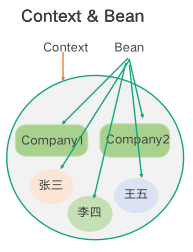

## ORM

ORM 就是对象关系匹配，解决面向对象与关系数据库存在的互不匹配的问题。简单来说，就是把关系数据库中的数据转换成面向对象程序中的对象。

<font style="color:rgb(63, 63, 63);">Hibernate 和 MyBatis 的特点和区别</font>

+ Hibernate 对数据库结构提供了完整的封装，实现了 POJO 对象与数据库表之间的映射，能够自动生成并执行 SQL 语句。只要定义了 POJO 到数据库表的映射关系，就可以通过 Hibernate 提供的方法完成数据库操作。Hibernate 符合 JPA 规范，就是 Java 持久层 API。
+ MyBatis 通过映射配置文件，将 SQL 所需的参数和返回的结果字段映射到指定对象，MyBatis 不会自动生成 SQL，需要自己定义 SQL 语句，不过更方便对 SQL 语句进行优化。

总结起来，Hibernate 配置要比 MyBatis 复杂的多，学习成本也比 MyBatis 高。MyBatis，简单、高效、灵活，但是需要自己维护 SQL；Hibernate 功能强大、全自动、适配不同数据库，但是非常复杂，灵活性稍差。

### #{} 和 ${} 的区别是什么？

 #{}: 解析为SQL时，会将形参变量的值取出，并自动给其添加引号。  

 ${}: 解析为SQL时，将形参变量的值直接取出，直接拼接显示在SQL中  。

 ${}方式是将形参和SQL语句直接拼接形成完整的SQL命令后，再进行编译，所以可以通过精心设计的形参变量的值，来改变原SQL语句的使用意图从而产生安全隐患，即为SQL注入攻击。  

 #{}方式则是先用占位符代替参数将SQL语句先进行预编译，然后再将参数中的内容替换进来。由于SQL语句已经被预编译过，其SQL意图将无法通过非法的参数内容实现更改，其参数中的内容，无法变为SQL命令的一部分。故，**#{}可以防止SQL注入而${}却不行**

## Spring

### Context 和 Bean

<font style="color:rgb(63, 63, 63);">Spring 进行 IoC 实现时使用的两个概念：Context 上下文和 Bean。如下图所示，所有被 Spring 管理的、由 Spring 创建的、用于依赖注入的对象，就叫作一个 Bean。Spring 创建并完成依赖注入后，所有 Bean 统一放在一个叫作 Context 的上下文中进行管理。</font>

<font style="color:rgb(63, 63, 63);">      </font>

### <font style="color:rgb(63, 63, 63);">Spring两大特性：IoC和AOP</font>

**IoC（Inversion of Control:控制反转）**

**为什么叫控制反转？**

+ **控制**：指的是对象创建（实例化、管理）的权力**
+ **反转：控制权交给外部环境（Spring 框架、IoC 容器）**

控制反转（IOC），传统的 java 开发模式中，当需要一个对象时，我们会自己使用 new 或者 getInstance 等直接

或者间接调用构造方法创建一个对象。而在 spring 开发模式中，spring 容器使用了工厂模式为我们创建了所需要的对象，不需要我们自己创建了，直接调用 spring 提供的对象就可以了，这是控制反转的思想。

依赖注入（DI），spring 使用 javaBean 对象的 set 方法或者带参数的构造方法为我们在创建所需对象时将其属

性自动设置所需要的值的过程，就是依赖注入的思想。


<font style="color:rgb(63, 63, 63);">在 Spring 中，对象的属性是由对象自己创建的，就是正向流程；如果属性不是对象创建，而是由 Spring 来自动进行装配，就是控制反转。DI 也就是依赖注入，就是实现控制反转的方式。正向流程导致了对象于对象之间的高耦合，IoC 可以解决对象耦合的问题，有利于功能的复用，能够使程序的结构变得非常灵活。</font>


<font style="color:rgb(63, 63, 63);">AOP，英文全称Aspect-Oriented Programming，意为面向切面编程。  </font>

<font style="color:rgb(63, 63, 63);">AOP 核心思想就是将横切关注点从核心业务逻辑中分离出来，形成一个个的</font>**切面（Aspect）**<font style="color:rgb(63, 63, 63);">。</font>

+ **连接点JoinPoint**<font style="color:rgb(63, 63, 63);">：是在应用执行过程中能够插入切面的一个点。 一个类的所有方法前、后、抛出异常时等都是连接点。  </font>
+ **通知（Advice）**<font style="color:rgb(63, 63, 63);">：通知就是切面在某个连接点要执行的操作。通知有五种类型，分别是前置通知（Before）、后置通知（After）、返回通知（AfterReturning）（在目标方法成功执行之后调用通知）、异常通知（AfterThrowing）和环绕通知（Around）。前四种通知都是在目标方法的前后执行，而环绕通知可以控制目标方法的执行过程。</font>
+ **切点（Pointcut）**：切点定义了切面在何处要织入的一个或者多个连接点。一个切点是一个表达式，**它用来匹配哪些连接点需要被切面所增强**。切点可以通过注解、正则表达式、逻辑运算等方式来定义。比如 execution(* com.xyz.service..*(..))匹配 com.xyz.service 包及其子包下的类或接口。
+ **切面（Aspect）**：是通知和切点的结合。通知和切点共同定义了切面的全部内容。共有功能的实现。如日志切面、权限切面、验签切面等。在实际开发中通常是一个存放共有功能实现的标准Java类。当Java类使用了@Aspect注解修饰时，就能被AOP容器识别为切面。 
+ **引入**：引入允许我们向现有类添加新方法或属性。
+ **织入（Weaving）**<font style="color:rgb(63, 63, 63);">：将切面应用到目标对象从而创建一个新的代理对象的过程。这个过程可以发生在编译时、类加载时、运行时。Spring是在运行时完成织入，运行时织入通过Java语言的反射机制与动态代理机制来动态实现。</font>
  - 编译期： 在目标类编译时，切面被织入。这种方式需要特殊的编译器。AspectJ的织入编译器就是以这种方式织入切面的。
  -  类加载期：切面在目标加载到JVM时被织入。这种方式需要特殊的类加载器(class loader)它可以在目标类被引入应用之前增强该目标类的字节码。
  - 运行期： 切面在应用运行到某个时刻时被织入。一般情况下，在织入切面时，AOP容器会为目标对象动态地创建一个代理对象。SpringAOP就是以这种方式织入切面的。

Spring AOP

+ <font style="color:rgb(63, 63, 63);">AOP的做法是将</font>**通用与业务无关的功能**<font style="color:rgb(63, 63, 63);">抽象封装为切面类</font>
+ 切面可在配置目标方法的执行前、后运行，真正做到即插即用


五种通知类型


Spring AOP实现原理

<font style="color:rgb(63, 63, 63);">Spring基于代理类实现功能动态扩展,包含两种形式：</font>

+ <font style="color:rgb(63, 63, 63);">目标类拥有接口,通过JDK动态代理实现功能扩展</font>
+ <font style="color:rgb(63, 63, 63);">目标类没有接口,通过CGLib组件实现功能扩展</font>
  - CGLib是运行时字节码增强技术
  - AOP会运行时生成目标继承类字节码的方式进行行为扩展

<font style="color:rgb(63, 63, 63);">CGLib执行过程</font>

1. 生成代理类的二进制字节码文件
2. 加载二进制字节码，生成Class对象(Class.forName())
3. 通过反射机制获得实例构造，并创建代理类对象


<font style="color:rgb(63, 63, 63);">AOP的实现</font>

Spring AOP就是基于动态代理的，如果要代理的对象，实现了某个接⼝，那么Spring AOP会使⽤JDK Proxy，去创建代理对象，⽽对于没有实现接⼝的对象，就⽆法使⽤ JDK Proxy 去进⾏代理了，这时候Spring AOP会使⽤Cglib ，这时候Spring AOP会使⽤ Cglib ⽣成⼀个被代理对象的⼦类来作为代理，如下图所示：


AOP 的实现是通过代理模式，在调用对象的某个方法时，执行插入的切面逻辑。实现的方式有动态代理，也叫运行时增强，比如 JDK 代理、CGLIB；静态代理是在编译时进行织入或类加载时进行织入，比如 AspectJ。关于 AOP 还需要了解一下对应的 Aspect、pointcut、advice 等注解和具体使用方式。


AOP的应用

<font style="color:rgb(63, 63, 63);">      </font>

一个系统中会有多个不同的服务，例如用户服务、商品信息服务等等，每个服务的Controller层都需要验证参数，都需要处理异常，如果按照图中红色的部分，对不同服务的纵向处理流程进行横切，在每个切面上完成通用的功能，例如身份认证、验证参数、处理异常等等、这样就不用在每个服务中都写相同的逻辑了，这就是 AOP 思想解决的问题。AOP 以功能进行划分，对服务顺序执行流程中的不同位置进行横切，完成各服务共同需要实现的功能。

### AOP 的应用场景有哪些？

+ 日志记录：自定义日志记录注解，利用 AOP，一行代码即可实现日志记录。
+ 性能统计：利用 AOP 在目标方法的执行前后统计方法的执行时间，方便优化和分析。
+ 事务管理：@Transactional注解可以让 Spring 为我们进行事务管理比如回滚异常操作，免去了重复的事务管理逻辑。@Transactional注解就是基于 AOP 实现的。
+ 权限控制：利用 AOP 在目标方法执行前判断用户是否具备所需要的权限，如果具备，就执行目标方法，否则就不执行。例如，SpringSecurity 利用@PreAuthorize注解一行代码即可自定义权限校验。
+ 接口限流：利用 AOP 在目标方法执行前通过具体的限流算法和实现对请求进行限流处理。
+ 缓存管理：利用 AOP 在目标方法执行前后进行缓存的读取和更新。


接下来是 Spring 中机制和概念相关的知识点，


### 核心接口/类

需要重点掌握的核心类。

+ ApplicationContext 保存了 IoC 的整个应用上下文，可以通过其中的 BeanFactory 获取到任意到 Bean；
+ BeanFactory 主要的作用是根据 Bean Definition 来创建具体的 Bean；
+ BeanWrapper 是对 Bean 的包装，一般情况下是在 Spring IoC 内部使用，提供了访问 Bean 的属性值、属性编辑器注册、类型转换等功能，方便 IoC 容器用统一的方式来访问 Bean 的属性；
+ FactoryBean 通过 getObject 方法返回实际的 Bean 对象，例如 Motan 框架中 referer 对 service 的动态代理就是通过 FactoryBean 来实现的。

### 应用

 Spring 应用相关的知识点


#### @Autowired 和 @Resource 的区别是什么？

Autowired 属于 Spring 内置的注解，默认的注入方式为byType（根据类型进行匹配），会优先根据接口类型去匹配并注入 Bean （接口的实现类）。

**这会有什么问题呢？** 当一个接口存在多个实现类的话，byType这种方式就无法正确注入对象了，因为这个时候 Spring 会同时找到多个满足条件的选择，默认情况下它自己不知道选择哪一个。

这种情况下，注入方式会变为 byName（根据名称进行匹配），这个名称通常就是类名（首字母小写）。就比如说下面代码中的 smsService 就是我这里所说的名称。

```java
// smsService 就是我们上面所说的名称
@Autowired
private SmsService smsService;
```

举个例子，SmsService 接口有两个实现类: SmsServiceImpl1和 SmsServiceImpl2，且它们都已经被 Spring 容器所管理。

```java
// 报错，byName 和 byType 都无法匹配到 bean
@Autowired
private SmsService smsService;
// 正确注入 SmsServiceImpl1 对象对应的 bean
@Autowired
private SmsService smsServiceImpl1;
// 正确注入  SmsServiceImpl1 对象对应的 bean
// smsServiceImpl1 就是我们上面所说的名称
@Autowired
@Qualifier(value = "smsServiceImpl1")
private SmsService smsService;
```

我们还是建议通过 @Qualifier 注解来显式指定名称而不是依赖变量的名称。


@Resource属于 JDK 提供的注解，默认注入方式为 byName。如果无法通过名称匹配到对应的 Bean 的话，注入方式会变为byType。

@Resource 有两个比较重要且日常开发常用的属性：name（名称）、type（类型）。

```java
public @interface Resource {
    String name() default "";
    Class<?> type() default Object.class;
}
```

如果仅指定 name 属性则注入方式为byName，如果仅指定type属性则注入方式为byType，如果同时指定name 和type属性（不建议这么做）则注入方式为byType+byName。

```java
// 报错，byName 和 byType 都无法匹配到 bean
@Resource
private SmsService smsService;
// 正确注入 SmsServiceImpl1 对象对应的 bean
@Resource
private SmsService smsServiceImpl1;
// 正确注入 SmsServiceImpl1 对象对应的 bean（比较推荐这种方式）
@Resource(name = "smsServiceImpl1")
private SmsService smsService;
```

简单总结一下：

+ @Autowired 是 Spring 提供的注解，@Resource 是 JDK 提供的注解。
+ Autowired 默认的注入方式为byType（根据类型进行匹配），@Resource默认注入方式为 byName（根据名称进行匹配）。
+ 当一个接口存在多个实现类的情况下，@Autowired 和@Resource都需要通过名称才能正确匹配到对应的 Bean。Autowired 可以通过 @Qualifier 注解来显式指定名称，@Resource可以通过 name 属性来显式指定名称。
+ @Autowired 支持在构造函数、方法、字段和参数上使用。@Resource 主要用于字段和方法上的注入，不支持在构造函数或参数上使用。


#### 前后端传值

##### `@PathVariable`

用于获取路径参数。

##### `@RequestParam`

把HTTP的参数重新绑定规则@RequestParam("_type") String type。

##### `@RequestBody`

用于**读取**Request 请求（可能是 POST,PUT,DELETE,GET 请求）的 body 部分并且**Content-Type 为 application/json** 格式的数据，接收到数据之后会自动将数据绑定到 Java 对象上去。系统会使用`HttpMessageConverter`或者自定义的`HttpMessageConverter`将请求的 body 中的 json 字符串转换为 java 对象。


需要注意的是：一个请求方法只可以有一个`@RequestBody`，但是可以有多个`@RequestParam`**和**`@PathVariable`。 如果你的方法必须要用两个 `@RequestBody`来接受数据的话，大概率是你的数据库设计或者系统设计出问题了！


#### `@Component`,`@Repository`,`@Service`, `@Controller`

我们一般使用 `@Autowired` 注解让 Spring 容器帮我们自动装配 bean。要想把类标识成可用于 `@Autowired` 注解自动装配的 bean 的类,可以采用以下注解实现：

+ `@Component` ：通用的注解，可标注任意类为 `Spring` 组件。如果一个 Bean 不知道属于哪个层，可以使用`@Component` 注解标注。
+ `@Repository` : 对应持久层即 Dao 层，主要用于数据库相关操作。
+ `@Service` : 对应服务层，主要涉及一些复杂的逻辑，需要用到 Dao 层。
+ `@Controller` : 对应 Spring MVC 控制层，主要用于接受用户请求并调用 Service 层返回数据给前端页面。


<font style="color:rgb(63, 63, 63);">自动装配机制按类型匹配进行自动装配，按 Bean 名称进行自动装配，构造器中的自动装配和自动检测等主要的四种方式</font>

### Context 初始化流程

如下图所示，左侧是三种类型的 Context：

+ XML 配置方式的 Context；
+ Spring Boot 的 Context；
+ Web 服务的 Context。


<font style="color:rgb(63, 63, 63);">  
</font>

不论哪种 Context，创建后都会调用到 AbstractApplicationContext 类的 refresh 方法，流程如下。

1. 首先对刷新进行准备，包括设置开始时间、设置激活状态、初始化 Context 环境中的占位符，这个动作根据子类的需求由子类来执行，然后验证是否缺失必要的 properties。
2. 刷新并获得内部的 Bean Factory。
3. 对 BeanFactory 进行准备工作，比如设置类加载器和后置处理器、配置不进行自动装配的类型、注册默认的环境 Bean。
4. <font style="color:rgb(63, 63, 63);">为 Context 的子类提供后置处理 BeanFactory 的扩展能力。如果子类想在 Bean 定义加载完成后，开始初始化上下文之前做一些特殊逻辑，可以复写这个方法。</font>
5. <font style="color:rgb(63, 63, 63);">执行 Context 中注册的 Bean Factory 后缀处理器。这里有两种后置处理器，一种是可以注册 Bean 的后缀处理器，另一种是针对 BeanFactory 进行处理的后置处理器。执行的顺序是，先按优先级执行可注册 Bean 的处理器，在按优先级执行针对 BeanFactory的处理器。对 Spring Boot 来说，这一步会进行注解 Bean Definition 的解析。流程如图右侧所示，由 ConfigurationClassPostProcessor 触发、由 ClassPathBeanDefinitionScanner 解析并注册到 BeanFactory。</font>
6. <font style="color:rgb(63, 63, 63);">按优先级顺序在 BeanFactory 中注册  Bean的后缀处理器，Bean 后置处理器可以在 Bean 初始化前、后执行处理。</font>
7. <font style="color:rgb(63, 63, 63);">初始化消息源，消息源用来支持消息的国际化。</font>
8. <font style="color:rgb(63, 63, 63);">初始化应用事件广播器。事件广播器用来向 ApplicationListener 通知各种应用产生的事件，是一个标准的观察者模式。</font>
9. <font style="color:rgb(63, 63, 63);">是留给子类的扩展步骤，用来让特定的 Context 子类初始化其他的 Bean。</font>
10. <font style="color:rgb(63, 63, 63);">把实现了 ApplicationListener 的 Bean 注册到事件广播器，并对广播器中的早期未广播事件进行通知。</font>
11. <font style="color:rgb(63, 63, 63);">冻结所有 Bean 描述信息的修改，实例化非延迟加载的单例 Bean。</font>
12. <font style="color:rgb(63, 63, 63);">完成上下文的刷新工作，调用 LifecycleProcessor 的 onFresh() 方法以及发布 ContextRefreshedEvent 事件。</font>
13. <font style="color:rgb(63, 63, 63);">在 finally 中，执行第十三步，重置公共的缓存，比如 ReflectionUtils 中的缓存、 AnnotationUtils 中的缓存等等；</font>

<font style="color:rgb(63, 63, 63);">至此，Spring 的 Context 初始化完成。</font>

### Bean 生命周期

绿色的部分，Bean 的创建过程。


1. 调用 Bean 的构造方法创建 Bean；
2. 通过反射调用 setter 方法进行属性的依赖注入；
3. 如果实现 BeanNameAware 接口的话，会设置 Bean 的 name；
4. 如果实现了 BeanFactoryAware，会把 BeanFactory 设置给 Bean；
5. 如果实现了 ApplicationContextAware，会给 Bean 设置 ApplictionContext；
6. 如果实现了 BeanPostProcessor 接口，则执行前置处理方法；
7. 实现了 InitializingBean 接口的话，执行 afterPropertiesSet 方法；
8. 执行自定义的 init 方法；
9. 执行 BeanPostProcessor 接口的后置处理方法。

以上就完成了 Bean 的创建过程。而在使用完 Bean 需要销毁时，会先执行 DisposableBean 接口的 destroy 方法，然后在执行自定义的 destroy 方法。

### 扩展接口

<font style="color:rgb(63, 63, 63);">在对 Spring 进行定制化功能扩展时，可以选择一些扩展点，如下图所示。</font>


+ BeanFactoryPostProcessor 是 BeanFactory 后置处理器，支持在 BeanFactory 标准初始化完成后，对 BeanFactory 进行一些额外处理。这时所有的 Bean 的描述信息已经加载完毕，但是还没有进行 Bean 初始化。例如前面提到的 PropertyPlaceholderConfigurer，就是在这个扩展点上对 Bean 属性中的占位符进行替换。
+ BeanDefinitionRegistryPostProcessor，它扩展自BeanFactoryPostProcessor，在执行 BeanFactoryPostProcessor 的功能前，提供了可以添加 Bean Definition 的能力，允许在初始化一般 Bean 前，注册额外的 Bean。例如可以在这里根据 Bean 的 Scope 创建一个新的代理 Bean。
+ BeanPostProcessor，提供了在 Bean 初始化之前和之后插入自定义逻辑的能力。与 BeanFactoryPostProcessor 的区别是处理的对象不同，BeanFactoryPostProcessor 是对 BeanFactory 进行处理，BeanPostProcessor 是对 Bean 进行处理。

上面这三个扩展点，可以通过实现 Ordered  和PriorityOrdered 接口来指定执行顺序。实现 PriorityOrdered 接口的 processor 会先于实现 Ordered 接口的执行。

+ ApplicationContextAware，可以获得 ApplicationContext 及其中的 Bean，当需要在代码中动态获取 Bean 时，可以通过实现这个接口来实现。
+ InitializingBean，可以在 Bean 初始化完成，所有属性设置完成后执行特定逻辑，例如对自动装配对属性进行验证等。
+ DisposableBean，用于在 Bean 被销毁前执行特定的逻辑，例如做一些回收工作等。
+ ApplicationListener，用来监听 Spring 的标准应用事件或者自定义事件。

## Spring Boot

<font style="color:rgb(63, 63, 63);">Spring Boot 的目标是简化 Spring 应用和服务的创建、开发与部署，简化了配置文件，使用嵌入式 Web 服务器，含有诸多开箱即用的微服务功能，可以和 Spring Cloud 联合部署。Spring Boot 的核心思想是约定大于配置，应用只需要很少的配置即可，简化了应用开发模式。</font>

<font style="color:rgb(63, 63, 63);">      </font>

首先是 Spring Boot 启动流程的主要步骤：

1. 要配置 Environment。
2. 准备 Context 上下文，包括执行 ApplicationContext 的后置处理、初始化 Initializer、通知Listener 处理 ContextPrepared 和 ContextLoaded 事件。
3. 执行 refreshContext，也就是前面介绍过的 AbstractApplicationContext 类的 refresh 方法。
4. Spring Boot 中有两种上下文，一种是 bootstrap, 另外一种是 application。其中，bootstrap 是应用程序的父上下文，会先于 applicaton 加载。bootstrap 主要用于从额外的资源来加载配置信息，还可以在本地外部配置文件中解密属性。bootstrap 里面的属性会优先加载，默认也不能被本地相同配置覆盖。

@SpringBootApplication包含了 @ComponentScan、@EnableAutoConfiguration、@SpringBootConfiguration 三个注解，而  @SpringBootConfiguration 注解包含了 @Configuration 注解。也就是 Spring Boot 的自动配置功能。@Conditional 注解就是控制自动配置的生效条件的注解，例如 Bean 或 Class 存在、不存在时进行配置，当满足条件时进行配置等。

Spring Boot 的几个特色模块

+ Starter 是 Spring Boot 提供的无缝集成功能的一种方式，使用某个功能时开发者不需要关注各种依赖库的处理，不需要具体的配置信息，由 Spring Boot 自动配置进行 Bean的创建。例如需要使用 Web 功能时，只需要在依赖中引入 Spring-boot-starter-web 即可。
+ Actuator 是用来对应用程序进行监视和管理，通过 RESTful API 请求来监管、审计、收集应用的运行情况。
+ DevTools 提供了一系列开发工具的支持，来提高开发效率。例如热部署能力等。
+ CLI 就是命令行接口，是一个命令行工具，支持使用 Groovy 脚本，可以快速搭建 Spring 原型项目。

### @Component 和 @Bean 的区别是什么

+ @Component 注解作用于类，而@Bean注解作用于方法。
+ @Component通常是通过类路径扫描来自动侦测以及自动装配到 Spring 容器中（我们可以使用 @ComponentScan 注解定义要扫描的路径从中找出标识了需要装配的类自动装配到 Spring 的 bean 容器中）。@Bean 注解通常是我们在标有该注解的方法中定义产生这个 bean,@Bean告诉了 Spring 这是某个类的实例，当我需要用它的时候还给我。
+ @Bean 注解比 @Component 注解的自定义性更强，而且很多地方我们只能通过 @Bean 注解来注册 bean。比如当我们引用第三方库中的类需要装配到 Spring容器时，则只能通过 @Bean来实现。

Component 和 Bean 注解的区别

1. @Component 注解在类上使用表明这个类是个组件类，需要 Spring 为这个类创建 Bean。
2. @Bean 注解使用在方法上，告诉 Spring 这个方法将会返回一个 Bean 对象，需要把返回的对象注册到 Spring 的应用上下文中。

### Bean 的作用域有哪些?

Spring 中 Bean 的作用域通常有下面几种：

+ **singleton** : IoC 容器中只有唯一的 bean 实例。Spring 中的 bean 默认都是单例的，是对单例设计模式的应用。
+ **prototype** : 每次获取都会创建一个新的 bean 实例。也就是说，连续 getBean() 两次，得到的是不同的 Bean 实例。
+ **request** （仅 Web 应用可用）: 每一次 HTTP 请求都会产生一个新的 bean（请求 bean），该 bean 仅在当前 HTTP request 内有效。
+ **session** （仅 Web 应用可用） : 每一次来自新 session 的 HTTP 请求都会产生一个新的 bean（会话 bean），该 bean 仅在当前 HTTP session 内有效。
+ **application/global-session** （仅 Web 应用可用）：每个 Web 应用在启动时创建一个 Bean（应用 Bean），该 bean 仅在当前应用启动时间内有效。
+ **websocket** （仅 Web 应用可用）：每一次 WebSocket 会话产生一个新的 bean。


如何配置 bean 的作用域呢？

xml 方式：

```xml
<bean id="..." class="..." scope="singleton"></bean>
```

注解方式：

```java
@Bean
@Scope(value = ConfigurableBeanFactory.SCOPE_PROTOTYPE)
public Person personPrototype() {
    return new Person();
}
```


### @Scope

声明 Spring Bean 的作用域，使用方法:

```java
@Bean
@Scope("singleton")
public Person personSingleton() {
    return new Person();
}
```

**四种常见的 Spring Bean 的作用域：**

+ singleton : 唯一 bean 实例，Spring 中的 bean 默认都是单例的。
+ prototype : 每次请求都会创建一个新的 bean 实例。
+ request : 每一次 HTTP 请求都会产生一个新的 bean，该 bean 仅在当前 HTTP request 内有效。
+ session : 每一个 HTTP Session 会产生一个新的 bean，该 bean 仅在当前 HTTP session 内有效。


### Bean 是线程安全的吗？

Spring 框架中的 Bean 是否线程安全，取决于其作用域和状态。

最常用的两种作用域 prototype 和 singleton 为例。几乎所有场景的 Bean 作用域都是使用默认的 singleton ，重点关注 singleton 作用域即可。

prototype 作用域下，每次获取都会创建一个新的 bean 实例，不存在资源竞争问题，所以不存在线程安全问题。singleton 作用域下，IoC 容器中只有唯一的 bean 实例，可能会存在资源竞争问题（取决于 Bean 是否有状态）。如果这个 bean 是有状态的话，那就存在线程安全问题（有状态 Bean 是指包含可变的成员变量的对象）。

不过，大部分 Bean 实际都是无状态（没有定义可变的成员变量）的（比如 Dao、Service），这种情况下， Bean 是线程安全的。

对于有状态单例 Bean 的线程安全问题，常见的有两种解决办法：

1. 在 Bean 中尽量避免定义可变的成员变量。
2. 在类中定义一个 ThreadLocal 成员变量，将需要的可变成员变量保存在 ThreadLocal 中（推荐的一种方式）。


### 读取配置信息

#### `@Value`(常用)

使用 `@Value("${property}")` 读取比较简单的配置信息：

```java
@Value("${wuhan2020}")
String wuhan2020;
```


#### `@ConfigurationProperties`(常用)

通过`@ConfigurationProperties`读取配置信息并与 bean 绑定。

```java
@Component
@ConfigurationProperties(prefix = "library")
class LibraryProperties {
    @NotEmpty
    private String location;
    private List<Book> books;

    @Setter
    @Getter
    @ToString
    static class Book {
        String name;
        String description;
    }
  省略getter/setter
  ......
}
```


## SpringMVC

### SpringMVC 工作原理了解吗?

**Spring MVC 原理如下图所示：**


**流程说明（重要）：**

1. 客户端（浏览器）发送请求， DispatcherServlet拦截请求。
2. DispatcherServlet 根据请求信息调用 HandlerMapping 。HandlerMapping 根据 URL 去匹配查找能处理的 Handler（也就是我们平常说的 Controller 控制器） ，并会将请求涉及到的拦截器和 Handler 一起封装。
3. DispatcherServlet 调用 HandlerAdapter适配器执行 Handler 。
4. Handler 完成对用户请求的处理后，会返回一个 ModelAndView 对象给DispatcherServlet，ModelAndView 顾名思义，包含了数据模型以及相应的视图的信息。Model 是返回的数据对象，View 是个逻辑上的 View。
5. ViewResolver 会根据逻辑 View 查找实际的 View。
6. DispaterServlet 把返回的 Model 传给 View（视图渲染）。
7. 把 View 返回给请求者（浏览器）

当一个请求到来时， **DispatcherServlet** 通过请求和事先解析好的**HandlerMapping**配置，找到对应的**处理器（ Handler ） **， 准备开始运行**处理器和拦截器组成的执行链**，而运行处理器需要有一个对应的环境， 这样它就有了一个**处理器的适配器（HandlerAdapter ）**，通过这个适配器就能运行对应的处理器及其拦截器，这里的处理器包含控制器的内容和其他增强的功能，在处理器返回**模型和视图给DispacherServlet **后，DispacherServlet 会把对应的视图信息传递给**视图解析器（ ViewResolver ）**。注意，这一步取决于是否使用逻辑视图，如果是逻辑视图，那么视图解析器就会解析它，然后把模型渲染到视图中去，最后响应用户的请求：如果不是逻辑视图， 则不会进行处理， 而是直接通过视图渲染数据模型。

### 统一异常处理怎么做？

推荐使用注解的方式统一异常处理，具体会使用到 @ControllerAdvice + @ExceptionHandler 这两个注解 。

**相关注解：**

1. `@ControllerAdvice` :注解定义全局异常处理类
2. `@ExceptionHandler` :注解声明异常处理方法

```java
@ControllerAdvice
@ResponseBody
public class GlobalExceptionHandler {

    @ExceptionHandler(BaseException.class)
    public ResponseEntity<?> handleAppException(BaseException ex, HttpServletRequest request) {
      //......
    }

    @ExceptionHandler(value = ResourceNotFoundException.class)
    public ResponseEntity<ErrorReponse> handleResourceNotFoundException(ResourceNotFoundException ex, HttpServletRequest request) {
      //......
    }

    /**
     * 请求参数异常处理
     */
    @ExceptionHandler(MethodArgumentNotValidException.class)
    public ResponseEntity<?> handleMethodArgumentNotValidException(MethodArgumentNotValidException ex, HttpServletRequest request) {
       ......
    }
}
```

这种异常处理方式下，会给所有或者指定的 Controller 织入异常处理的逻辑（AOP），当 Controller 中的方法抛出异常的时候，由被@ExceptionHandler 注解修饰的方法进行处理。

ExceptionHandlerMethodResolver 中 getMappedMethod 方法决定了异常具体被哪个被 @ExceptionHandler 注解修饰的方法处理异常。

### Spring MVC常用的注解有哪些？

@RequestMapping：用于处理请求 url 映射的注解，可用于类或方法上。用于类上，则表示类中的所有响应请求的方法都是以该地址作为父路径。

@RequestBody：注解实现接收http请求的json数据，将json转换为java对象。

@ResponseBody：注解实现将conreoller方法返回对象转化为json对象响应给客户。

@RestController注解相当于@ResponseBody ＋ @Controller


### 处理常见的 HTTP 请求类型

**5 种常见的请求类型:**

+ **GET**：请求从服务器获取特定资源。举个例子：GET /users（获取所有学生）
+ **POST**：在服务器上创建一个新的资源。举个例子：POST /users（创建学生）
+ **PUT**：更新服务器上的资源（客户端提供更新后的整个资源）。举个例子：PUT /users/12（更新编号为 12 的学生）
+ **DELETE**：从服务器删除特定的资源。举个例子：DELETE /users/12（删除编号为 12 的学生）
+ **PATCH**：更新服务器上的资源（客户端提供更改的属性，可以看做作是部分更新），使用的比较少。


## Spring事务`@Transactional`

**事务能否生效数据库引擎是否支持事务是关键。比如常用的 MySQL 数据库默认使用支持事务的 innodb引擎。但是，如果把数据库引擎变为 myisam，那么程序也就不再支持事务了！**

`@Transactional` 的工作机制是基于 AOP 实现的，AOP 又是使用动态代理实现的。如果目标对象实现了接口，默认情况下会采用 JDK 的动态代理，如果目标对象没有实现了接口,会使用 CGLIB 动态代理。

### @Transactional 注解失效场景

`Spring`提供了很好事务管理机制，主要分为`编程式事务`和`声明式事务`两种。

**编程式事务**：是指在代码中手动的管理事务的提交、回滚等操作，代码侵入性比较强，如下示例：

```java
try {
    //TODO something
     transactionManager.commit(status);
} catch (Exception e) {
    transactionManager.rollback(status);
    thrownew InvoiceApplyException("异常失败");
}
```

**声明式事务**：基于`AOP`面向切面的，它将具体业务与事务处理部分解耦，代码侵入性很低，所以在实际开发中声明式事务用的比较多。声明式事务也有两种实现方式，一是基于`TX`和`AOP`的xml配置文件方式，二种就是基于`@Transactional` 注解了。

```java
	@Transactional
    @GetMapping("/test")
    public String test() {
        int insert = cityInfoDictMapper.insert(cityInfoDict);
    }
```

### @Transactional失效场景

接下来我们结合具体的代码分析一下哪些场景下，@Transactional 注解会失效。

#### 1、@Transactional 应用在非 public 修饰的方法上

如果`Transactional`注解应用在非`public` 修饰的方法上，Transactional将会失效。


之所以会失效是因为在Spring AOP 代理时，如上图所示 `TransactionInterceptor` （事务拦截器）在目标方法执行前后进行拦截，`DynamicAdvisedInterceptor`（CglibAopProxy 的内部类）的 intercept 方法或 `JdkDynamicAopProxy` 的 invoke 方法会间接调用 `AbstractFallbackTransactionAttributeSource`的 `computeTransactionAttribute` 方法，获取Transactional 注解的事务配置信息。

```java
protected TransactionAttribute computeTransactionAttribute(Method method,
    Class<?> targetClass) {
        // Don't allow no-public methods as required.
        if (allowPublicMethodsOnly() && !Modifier.isPublic(method.getModifiers())) {
        returnnull;
}
```

此方法会检查目标方法的修饰符是否为 public，不是 public则不会获取`@Transactional` 的属性配置信息。

**注意：`protected`、`private` 修饰的方法上使用 `@Transactional` 注解，虽然事务无效，但不会有任何报错，这是我们很容犯错的一点。**

#### 2、@Transactional 注解属性 propagation 设置错误

这种失效是由于配置错误，若是错误的配置以下三种 propagation，事务将不会发生回滚。

`TransactionDefinition.PROPAGATION_SUPPORTS`：如果当前存在事务，则加入该事务；如果当前没有事务，则以非事务的方式继续运行。

`TransactionDefinition.PROPAGATION_NOT_SUPPORTED`：以非事务方式运行，如果当前存在事务，则把当前事务挂起。

`TransactionDefinition.PROPAGATION_NEVER`：以非事务方式运行，如果当前存在事务，则抛出异常。

#### 3、@Transactional  注解属性 rollbackFor 设置错误

`rollbackFor` 可以指定能够触发事务回滚的异常类型。Spring默认抛出了未检查`unchecked`异常（继承自 `RuntimeException` 的异常）或者 `Error`才回滚事务；其他异常不会触发回滚事务。如果在事务中抛出其他类型的异常，但却期望 Spring 能够回滚事务，就需要指定 **rollbackFor**属性。


```
// 希望自定义的异常可以进行回滚
@Transactional(propagation= Propagation.REQUIRED,rollbackFor= MyException.class
```

若在目标方法中抛出的异常是 `rollbackFor` 指定的异常的子类，事务同样会回滚。Spring 源码如下：

```java
private int getDepth(Class<?> exceptionClass, int depth) {
        if (exceptionClass.getName().contains(this.exceptionName)) {
            // Found it!
            return depth;
}
        // If we've gone as far as we can go and haven't found it...
        if (exceptionClass == Throwable.class) {
            return -1;
}
return getDepth(exceptionClass.getSuperclass(), depth + 1);
}
```

#### 4、同一个类中方法调用，导致@Transactional失效

开发中避免不了会对同一个类里面的方法调用，比如有一个类Test，它的一个方法A，A再调用本类的方法B（不论方法B是用public还是private修饰），但方法A没有声明注解事务，而B方法有。则外部调用方法A之后，方法B的事务是不会起作用的。这也是经常犯错误的一个地方。

那为啥会出现这种情况？其实这还是由于使用`Spring AOP`代理造成的，因为只有当事务方法被当前类以外的代码调用时，才会由`Spring`生成的代理对象来管理。

```java
//@Transactional
    @GetMapping("/test")
    private Integer A() throws Exception {
        CityInfoDict cityInfoDict = new CityInfoDict();
        cityInfoDict.setCityName("2");
        /**
         * B 插入字段为 3的数据
         */
        this.insertB();
        /**
         * A 插入字段为 2的数据
         */
        int insert = cityInfoDictMapper.insert(cityInfoDict);

        return insert;
    }

    @Transactional()
    public Integer insertB() throws Exception {
        CityInfoDict cityInfoDict = new CityInfoDict();
        cityInfoDict.setCityName("3");
        cityInfoDict.setParentCityId(3);

        return cityInfoDictMapper.insert(cityInfoDict);
    }
```

#### 5、异常被你的 catch“吃了”导致@Transactional失效

这种情况是最常见的一种 `@Transactional` 注解失效场景，

```java
    @Transactional
    private Integer A() throws Exception {
        int insert = 0;
        try {
            CityInfoDict cityInfoDict = new CityInfoDict();
            cityInfoDict.setCityName("2");
            cityInfoDict.setParentCityId(2);
            /**
             * A 插入字段为 2的数据
             */
            insert = cityInfoDictMapper.insert(cityInfoDict);
            /**
             * B 插入字段为 3的数据
             */
            b.insertB();
        } catch (Exception e) {
            e.printStackTrace();
        }
    }
```

如果B方法内部抛了异常，而A方法此时try catch了B方法的异常，那这个事务还能正常回滚吗？

答案：不能！

会抛出异常：

```java
org.springframework.transaction.UnexpectedRollbackException: Transaction rolled back because it has been marked as rollback-only
```

因为当`ServiceB`中抛出了一个异常以后，`ServiceB`标识当前事务需要`rollback`。但是`ServiceA`中由于你手动的捕获这个异常并进行处理，`ServiceA`认为当前事务应该正常`commit`。此时就出现了前后不一致，也就是因为这样，抛出了前面的`UnexpectedRollbackException`异常。

`spring`的事务是在调用业务方法之前开始的，业务方法执行完毕之后才执行`commit` or `rollback`，事务是否执行取决于是否抛出`runtime异常`。如果抛出`runtime exception` 并在你的业务方法中没有catch到的话，事务会回滚。

在业务方法中一般不需要catch异常，如果非要catch一定要抛出`throw new RuntimeException()`，或者注解中指定抛异常类型`@Transactional(rollbackFor=Exception.class)`，否则会导致事务失效，数据commit造成数据不一致，所以有些时候 try catch反倒会画蛇添足。

#### 6、数据库引擎不支持事务

这种情况出现的概率并不高，事务能否生效数据库引擎是否支持事务是关键。常用的MySQL数据库默认使用支持事务的`innodb`引擎。一旦数据库引擎切换成不支持事务的`myisam`，那事务就从根本上失效了。


### @Transactional 的作用范围

1. **方法**：推荐将注解使用于方法上，不过需要注意的是：**该注解只能应用到 public 方法上，否则不生效。**
2. **类**：如果这个注解使用在类上的话，表明该注解对该类中所有的 public 方法都生效。
3. **接口**：不推荐这种使用方法，因为一旦标注在Interface上并且配置了Spring AOP 使用CGLib动态代理，将会导致`@Transactional`注解失效

### @Transactional注解有哪些属性？

##### propagation属性

传播行为是事务方法之间调用的问题。

`propagation` 代表事务的传播行为，默认值为 `Propagation.REQUIRED`，其他的属性信息如下：

⽀持当前事务的情况：

+ `Propagation.REQUIRED`**：**当方法被调用时，如果当前存在事务，则加入该事务，如果当前不存在事务，则创建一个新的事务。( 也就是说如果A方法和B方法都添加了注解，在默认传播模式下，A方法内部调用B方法，会把两个方法的事务合并为一个事务 ）
+ `Propagation.SUPPORTS`：如果当前存在事务，则加入该事务；如果当前不存在事务，则以非事务的方式继续运行。
+ `Propagation.MANDATORY`：如果当前存在事务，则加入该事务；如果当前不存在事务，则抛出异常。

不⽀持当前事务的情况：

+ `Propagation.REQUIRES_NEW`**：**（**无论是否存在当前事务，方法都会在新的事务中运行**）重新创建一个新的事务，如果当前存在事务，暂停当前的事务。**(** 当类A中的 a 方法用默认`Propagation.REQUIRED`模式，类B中的 b方法加上采用 `Propagation.REQUIRES_NEW`模式，然后在 a 方法中调用 b方法操作数据库，然而 a方法抛出异常后，b方法并没有进行回滚，因为`Propagation.REQUIRES_NEW`会暂停 a方法的事务 **)**
+ `Propagation.NOT_SUPPORTED`：以非事务的方式运行，如果当前存在事务，暂停当前的事务，直到该方法执行完，才恢复当前事务。
+ `Propagation.NEVER`：以非事务的方式运行，如果当前存在事务，则抛出异常。
+ `**Propagation.NESTED**` ： 如果当前存在事务，则创建⼀个事务作为当前事务的嵌套事务来运⾏；如果当前没有事务，则该取值等价于TransactionDefinition.PROPAGATION_REQUIRED。

##### isolation 属性

`isolation` ：事务的隔离级别，默认值为 `Isolation.DEFAULT`。

- **TransactionDefinition.ISOLATION_DEFAULT:** 使用后端数据库默认的隔离级别，Mysql 默认采用的 REPEATABLE_READ隔离级别 Oracle 默认采用的 READ_COMMITTED隔离级别.
- **TransactionDefinition.ISOLATION_READ_UNCOMMITTED:** 最低的隔离级别，允许读取尚未提交的数据变更，**可能会导致脏读、幻读或不可重复读**
- **TransactionDefinition.ISOLATION_READ_COMMITTED:** 允许读取并发事务已经提交的数据，**可以阻止脏读，但是幻读或不可重复读仍有可能发生**
- **TransactionDefinition.ISOLATION_REPEATABLE_READ:** 对同一字段的多次读取结果都是一致的，除非数据是被本身事务自己所修改，**可以阻止脏读和不可重复读，但幻读仍有可能发生。**
- **TransactionDefinition.ISOLATION_SERIALIZABLE:** 最高的隔离级别，完全服从ACID的隔离级别。所有的事务依次逐个执行，这样事务之间就完全不可能产生干扰，也就是说，**该级别可以防止脏读、不可重复读以及幻读**。但是这将严重影响程序的性能。通常情况下也不会用到该级别。

##### timeout 属性

`timeout` ：事务的超时时间，默认值为 -1。如果超过该时间限制但事务还没有完成，则自动回滚事务。

##### readOnly 属性

`readOnly` ：指定事务是否为只读事务，默认值为 false；为了忽略那些不需要事务的方法，比如读取数据，可以设置 read-only 为 true。

##### rollbackFor 属性

`rollbackFor` ：用于指定能够触发事务回滚的异常类型，可以指定多个异常类型。

##### **noRollbackFor**属性

`noRollbackFor`：抛出指定的异常类型，不回滚事务，也可以指定多个异常类型。


### @Transactional(rollbackFor = Exception.class)注解了解吗？

Exception 分为运行时异常 RuntimeException 和非运行时异常。事务管理对于企业应用来说是至关重要的，即使出现异常情况，它也可以保证数据的一致性。

当 @Transactional 注解作用于类上时，该类的所有 public 方法将都具有该类型的事务属性，同时，我们也可以在方法级别使用该标注来覆盖类级别的定义。

@Transactional 注解默认回滚策略是只有在遇到RuntimeException(运行时异常) 或者 Error 时才会回滚事务，而不会回滚 Checked Exception（受检查异常）。这是因为 Spring 认为RuntimeException和 Error 是不可预期的错误，而受检异常是可预期的错误，可以通过业务逻辑来处理。


如果想要修改默认的回滚策略，可以使用 @Transactional 注解的 rollbackFor 和 noRollbackFor 属性来指定哪些异常需要回滚，哪些异常不需要回滚。例如，如果想要让所有的异常都回滚事务，可以使用如下的注解：

```java
@Transactional(rollbackFor = Exception.class)
public void someMethod() {
    // some business logic
}

```

如果想要让某些特定的异常不回滚事务，可以使用如下的注解：

```java
@Transactional(noRollbackFor = CustomException.class)
public void someMethod() {
    // some business logic
}
```

### 事务的特性（ACID）了解么?

1. **原子性**（Atomicity）：事务是最小的执行单位，不允许分割。事务的原子性确保动作要么全部完成，要么完全不起作用；
2. **一致性**（Consistency）：执行事务前后，数据保持一致，例如转账业务中，无论事务是否成功，转账者和收款人的总额应该是不变的；
3. **隔离性**（Isolation）：并发访问数据库时，一个用户的事务不被其他事务所干扰，各并发事务之间数据库是独立的；
4. **持久性**（Durability）：一个事务被提交之后。它对数据库中数据的改变是持久的，即使数据库发生故障也不应该对其有任何影响。

**只有保证了事务的持久性、原子性、隔离性之后，一致性才能得到保障。也就是说 A、I、D 是手段，C 是目的！** 


**MySQL 怎么保证原子性的？**

我们知道如果想要保证事务的原子性，就需要在异常发生时，对已经执行的操作进行**回滚**，在 MySQL 中，恢复机制是通过 **回滚日志（undo log）** 实现的，所有事务进行的修改都会先记录到这个回滚日志中，然后再执行相关的操作。如果执行过程中遇到异常的话，我们直接利用 **回滚日志** 中的信息将数据回滚到修改之前的样子即可！并且，回滚日志会先于数据持久化到磁盘上。这样就保证了即使遇到数据库突然宕机等情况，当用户再次启动数据库的时候，数据库还能够通过查询回滚日志来回滚之前未完成的事务。


## Spring设计模式

### <font style="color:rgb(0, 0, 0);">单例模式</font>

<font style="color:rgb(63, 63, 63);">线程安全的单例模式实现方式。</font>

单例模式常见的实现方式有三种。

+ 静态初始化方式，也叫作饿汉方式。实现的思路就是在类初始化时完成单例实例的创建，因此不会产生并发问题，在这种方式下不管是否会使用到这个单例，都会创建这个单例。
+ <font style="color:rgb(63, 63, 63);">双重检查，也叫作懒汉方式，只有在真正用到这个单例实例的时候才会去创建，如果没有使用就不会创建。这个方式必然会面对多个线程同时使用实例时的并发问题。为了解决并发访问问题，通过 synchronized 或者 lock 进行双重检查，保证只有一个线程能够创建实例。这里要注意内存可见性引起的并发问题，必须使用 volatile 关键字修饰单例变量。</font>
+ 单例注册表方式，Spring 中 Bean 的单例模式就是通过单例注册表方式实现的。


在我们的系统中，有一些对象其实我们只需要一个，比如说：线程池、缓存、对话框、注册表、日志对象、充当打印机、显卡等设备驱动程序的对象。事实上，这一类对象只能有一个实例，如果制造出多个实例就可能会导致一些问题的产生，比如：程序的行为异常、资源使用过量、或者不一致性的结果。

**使用单例模式的好处**<font style="color:rgb(63, 63, 63);"> :</font>

+ 对于频繁使用的对象，可以省略创建对象所花费的时间，这对于那些重量级对象而言，是非常可观的一笔系统开销；
+ 由于 new 操作的次数减少，因而对系统内存的使用频率也会降低，这将减轻 GC 压力，缩短 GC 停顿时间。

Spring 通过 ConcurrentHashMap 实现单例注册表的特殊方式实现单例模式。

Spring 实现单例的核心代码如下：

```java
// 通过 ConcurrentHashMap（线程安全） 实现单例注册表
private final Map<String, Object> singletonObjects = new ConcurrentHashMap<String, Object>(64);

public Object getSingleton(String beanName, ObjectFactory<?> singletonFactory) {
        Assert.notNull(beanName, "'beanName' must not be null");
        synchronized (this.singletonObjects) {
            // 检查缓存中是否存在实例
            Object singletonObject = this.singletonObjects.get(beanName);
            if (singletonObject == null) {
                //...省略了很多代码
                try {
                    singletonObject = singletonFactory.getObject();
                }
                //...省略了很多代码
                // 如果实例对象在不存在，我们注册到单例注册表中。
                addSingleton(beanName, singletonObject);
            }
            return (singletonObject != NULL_OBJECT ? singletonObject : null);
        }
    }
    //将对象添加到单例注册表
    protected void addSingleton(String beanName, Object singletonObject) {
            synchronized (this.singletonObjects) {
                this.singletonObjects.put(beanName, (singletonObject != null ? singletonObject : NULL_OBJECT));

            }
        }
}

```


### 工厂模式

工厂模式是创建不同类型实例时常用的方式，例如 Spring 中的各种 Bean 是有不同 Bean 工厂类进行创建的。

Spring 使用工厂模式可以通过 BeanFactory 或 ApplicationContext 创建 bean 对象。

**两者对比：**

+ <font style="color:rgb(63, 63, 63);">BeanFactory</font><font style="color:rgb(63, 63, 63);">：延迟注入(使用到某个 bean 的时候才会注入),相比于</font><font style="color:rgb(63, 63, 63);">ApplicationContext</font><font style="color:rgb(63, 63, 63);"> 来说会占用更少的内存，程序启动速度更快。</font>
+ <font style="color:rgb(63, 63, 63);">ApplicationContext：容器启动的时候，不管你用没用到，一次性创建所有 bean 。BeanFactory 仅提供了最基本的依赖注入支持，ApplicationContext 扩展了 BeanFactory ,除了有BeanFactory的功能还有额外更多功能，所以一般开发人员使用ApplicationContext会更多。</font>

### 模板方法

### 代理模式

代理模式，主要用在不适合或者不能直接引用另一个对象的场景，可以通过代理模式对被代理对象的访问行为进行控制。Java 的代理模式分为静态代理和动态代理。静态代理指在编译时就已经创建好了代理类，例如在源代码中编写的类；动态代理指在 JVM 运行过程中动态创建的代理类，使用动态代理的方法有 JDK 动态代理、CGLIB、Javassist 等。面试时遇到这个问题可以举个动态代理的例子，比如在 Motan RPC 中，是使用 JDK 的动态代理，通过反射把远程请求进行封装，使服务看上去就像在使用本地的方法。

### <font style="color:rgb(0, 0, 0);">责任链模式</font>

责任链模式有点像工厂的流水线，链上每一个节点完成对对象的某一种处理，例如 Netty 框架在处理消息时使用的 Pipeline 就是一种责任链模式。

### <font style="color:rgb(0, 0, 0);">适配器模式</font>

适配器模式，类似于我们常见的转接头，把两种不匹配的对象来进行适配，也可以起到对两个不同的对象进行解藕的作用。例如我们常用的日志处理框架 SLF4J，如果我们使用了 SLF4J 就可以跟 Log4j 或者 Logback 等具体的日志实现框架进行解藕。通过不同适配器将 SLF4J 与 Log4j 等实现框架进行适配，完成日志功能的使用。

### <font style="color:rgb(0, 0, 0);">观察者模式</font>

观察者模式也被称作发布订阅模式，适用于一个对象的某个行为需要触发一系列事件的场景，例如 gRPC 中的 Stream 流式请求的处理就是通过观察者模式实现的。

### 构造者模式

构造者模式，适用于一个对象有很多复杂的属性，需要根据不同情况创建不同的具体对象，例如创建一个 PB 对象时使用的 builder 方式。