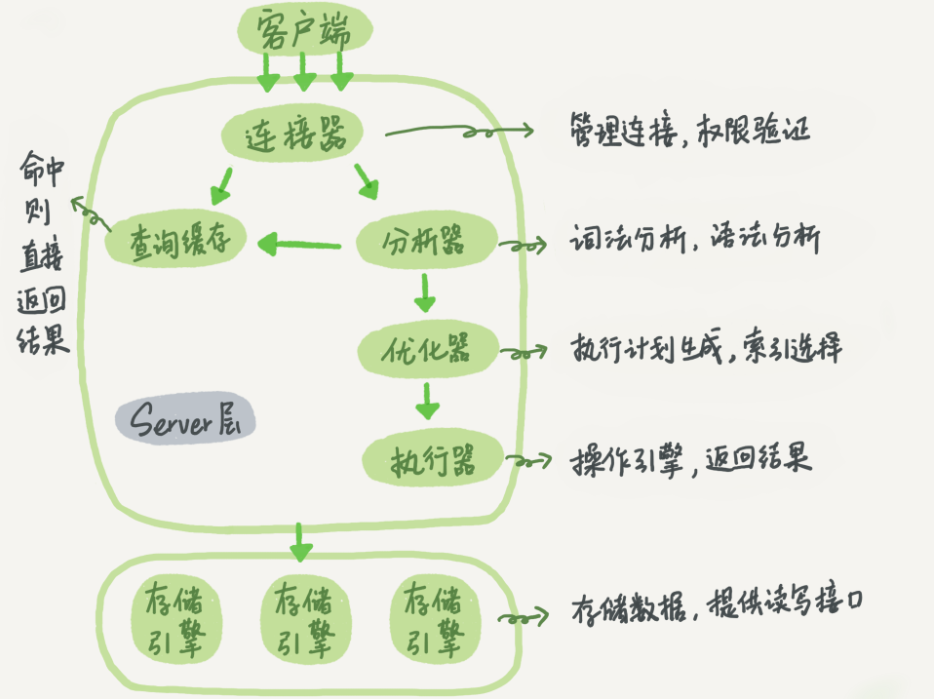
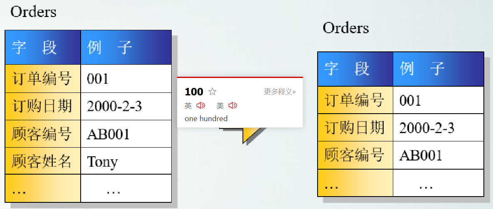

## SQL 语句在 MySQL的各个功能模块中的执行过程

大体来说，MySQL 可以分为 Server 层和存储引擎层两部分。不同的存储引擎共用一个Server 层，

Server 层包括连接器、查询缓存、分析器、优化器、执行器等，涵盖 MySQL 的大多数核心服务功能，以及所有的内置函数（如日期、时间、数学和加密函数等），所有跨存储引擎的功能都在这一层实现，比如存储过程、触发器、视图等。

而存储引擎层负责数据的存储和提取。其架构模式是插件式的，支持 InnoDB、MyISAM、Memory 等多个存储引擎。现在最常用的存储引擎是 InnoDB，它从 MySQL 5.5.5 版本开始成为了默认存储引擎


## 内连接、左连接、右连接的取区别？

内连接：内连接只显示两表中有关联的数据，没有对应相关数据，不显示。

左连接：左连接显示左表所有数据，右表没有对应的数据用NULL补齐，多了的数据删除

右连接：右连接显示右表所有数据，左表没有对应的数据用NULL对齐，多了的数据删除

## 数据库三范式

范式是具有最小冗余的表结构。

3 范式具体如下：

第一范式(1st NF －列都是不可再分)

第一范式的目标是确保每列的原子性:如果每列都是不可再分的最小数据单元（也称为最小的原子

单元），则满足第一范式（1NF）


第二范式(2nd NF－每个表只描述一件事情)

首先满足第一范式，并且表中非主键列不存在对主键的部分依赖。 第二范式要求每个表只描述一

件事情。


第三范式(3rd NF－ 不存在对非主键列的传递依赖)

第三范式定义是，满足第二范式，并且表中的列不存在对非主键列的传递依赖。除了主键订单编

号外，顾客姓名依赖于非主键顾客编号。



## 创建索引

**1、普通索引**

```sql
CREATE INDEX indexName ON mytable(column_name)
```

创建表的时候直接指定：

```sql
CREATE TABLE mytable(
       ID INT NOT NULL, 
       username VARCHAR(16) NOT NULL, 
       INDEX [indexName] (username(length))
 );
```


删除索引的语法：

```sql
DROP INDEX [indexName] ON mytable;
```


**2、唯一索引**  
索引列的值必须唯一，但允许有空值。如果是组合索引，则列值的组合必须唯一。

创建索引：

```sql
CREATE UNIQUE INDEX indexName ON mytable(username(length))
```


修改表结构：

```sql
ALTER table mytable ADD UNIQUE [indexName] (username(length))
```


创建表的时候直接指定：

```plain
CREATE TABLE mytable( 
     ID INT NOT NULL, 
      username VARCHAR(16) NOT NULL, 
      UNIQUE [indexName] (username(length))
 );
```


有四种方式来添加数据表的索引：

**1.ALTER TABLE tbl_name ADD PRIMARY KEY (column_list):** 该语句添加一个主键，这意味着索引值必须是唯一的，且不能为NULL。  
**2.ALTER TABLE tbl_name ADD UNIQUE index_name (column_list):** 这条语句创建索引的值必须是唯一的（除了NULL外，NULL可能会出现多次）。  
**3.ALTER TABLE tbl_name ADD INDEX index_name (column_list):** 添加普通索引，索引值可出现多次。  
**4.ALTER TABLE tbl_name ADD FULLTEXT index_name (column_list):**该语句指定了索引为 FULLTEXT ，用于全文索引。  
例如：

```plain
创建索引：ALTER TABLE testalter_tbl ADD INDEX (c);
删除索引：ALTER TABLE testalter_tbl DROP INDEX (c);
```


显示索引信息

```sql
SHOW INDEX FROM table_name\G
//通过添加 \G 来格式化输出信息。
```

